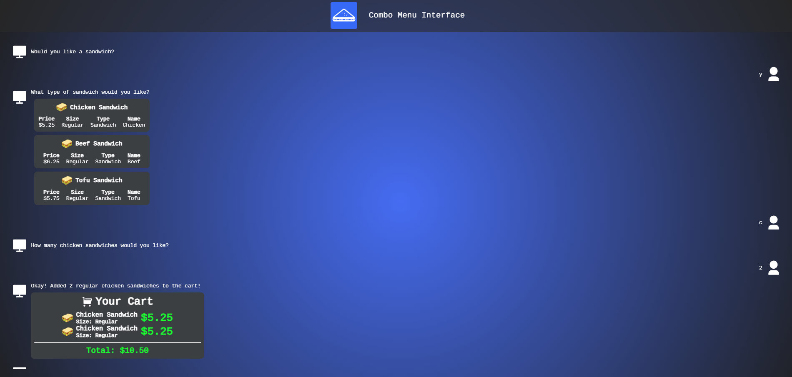

<h1 align="center">Combo Menu - CLI/GUI [PLTW]</h1>

### Combo Menu is a web application allowing you to order fast food items and get combo deals if your order meets the requirements. Styled as a chat application, you can submit your response and have *live* feedback! 

*Choose your style for this project based on the project's version.*

# Disclaimer
Combo Menu is a computer science project **inspired by Project Lead The Way (PLTW)**. PLTW is a non-profit organization that provides education in various fields, including computer science and engineering. Please acknowledge and appreciate PLTW's contributions to computer science education and attribute the inspiration for this project to their guidelines.

# Versions
### `v1.0.0`
Release version `v1.0.0` is a strictly **CLI-based** interface. Using **Prettytables** to display cart information.

### `v2.0.0`
Release version `v.2.0.0` is a strictly **GUI-based** interface using **HTML**, **CSS**, **JS**, and **Flask**. The frontend displays information from the backend **Flask** in a more human-friendly way, in the style of a chat application. 

# Installation
## CLI - `v1.0.0`
1. Install Python `v3.10.10` or newer [[python.org/downloads](https://www.python.org/downloads/)]
2. In your file explorer or IDE, navigate to the project folder using `cd path/to/directory`
3. To run the program use `python main.py`, if you have `Visual Studio Code` you can install the Python extension [[https://marketplace.visualstudio.com/items?itemName=ms-python.python](https://marketplace.visualstudio.com/items?itemName=ms-python.python)], and simply click the run icon, whilst viewing `server.py`.

## GUI - `v2.0.0`
1. Install Python `v3.10.10` or newer [[python.org/downloads](https://www.python.org/downloads/)]
2. In your file explorer or IDE, navigate to the project folder using `cd path/to/directory` 
3. Install these **requried** libraries using these commands:
- `pip install flask`
- `pip install jyserver`
4. To run the program use `python server.py`, if you have `Visual Studio Code` you can install the Python extension [[https://marketplace.visualstudio.com/items?itemName=ms-python.python](https://marketplace.visualstudio.com/items?itemName=ms-python.python)], and simply click the run icon, whilst viewing `server.py`.
5. `Crtl` + `Left Click` on the local host link to open and view the program.

# License
### The [MIT LICENSE](https://github.com/KingPr0o7/Combo-Menu/blob/main/LICENSE) grants permission to use and modify this project.
